# TESTING

Testing this site include the user friendly experiences was demonstrated on various screen sizes and external validating tools. 

## Validator testing

## HTML
https://validator.w3.org/


## CSS 
https://jigsaw.w3.org/css-validator/ 

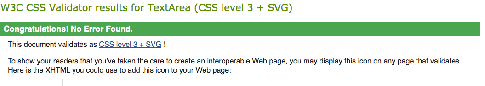


## USER STORY TESTING

1. As a new Visitor I want to be able to access the site quickly and efficiently. 

By making sure that the content is clear and concise, it means that users will be confronted with clear and concise information on what's on the page and what's interactive. 

The responsive Navbar ensures that functionality is maintained throughout with ease of access. 


2. As a new Visitor I want to see what sort of business I'm working with.

The moment you land on the page, you are immediately confronted with a brand logo and information with images detailing the services on offer, linking them to the necessary pages. 

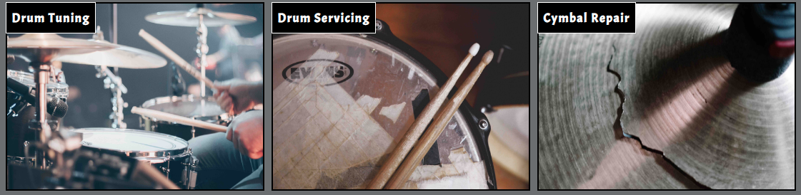

3. As a new visitor I dont want to be bombarded with large amounts of text.

Making sure that all text is clear and concise was at the heart of this development to ensure that users could clearly see where they were on the page, and that it still maintained an attractive appeal. 

4. I want to see what services are available

Each service has it's own dedicated page so not to confuse the user as to what page they're currently on, ensuring this took place makes it clean and easy to navigate around the website. 

5. What can this business offer me?

By maintaining interaction between business and client, forms allowing the user to give specific but worthwhile information on services they want to interact with means that they're able to feel satisfied with the interaction and that it's the right amount of information to move forward with an enquiries. 

6. I want to speak to the business

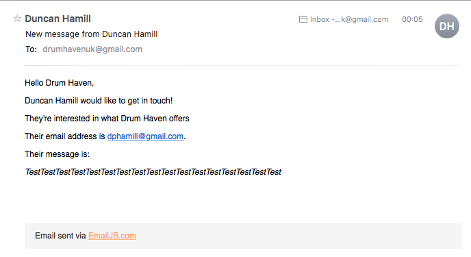

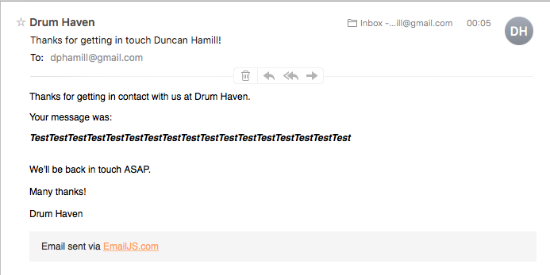

By filling out the contact form on the landing page, it allows the user the ability to ask more precise enquiries that you might not ask via social media. 
Social media links however are readily available at the footer of each page to maintain continuity. 

Lighthouse Report

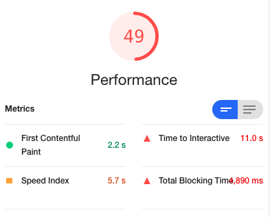
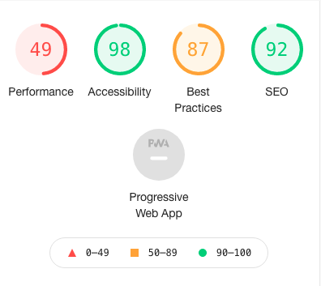

Scoring very highly on everything bar Performance, not entirely sure why exactly.

Quoted as “Values are estimated and may vary. The performance score is calculated directly from these metrics.”

# Unfixed Bugs

During the development of this website, I found my lack of understanding in regards to Javascript and jQuery really limited my ability to be able to able to solve issues when they arose unfortunately. 

When creating the function for the tuning form, one problem I'd had liked to have solved is that when a user selects a tom size, in the preceding option for the next tom, that any tom sizes smaller than the one selected previously, aren't available to be selected. 

To combat this, I have used a prompt above the select option informing the user of the inputs needed. 

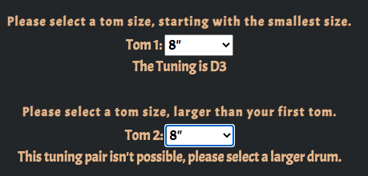
Unfortunately, this means that the user is able to make a user led error allowing the function to not display the correct tuning relationships should they not follow the prompts for inputting correct values. 

```
else if (FoPcToTwoTu.value == '13' && FoPcToOneTu.value == '13') {
  	document.getElementById('4pctom2tune').innerHTML = "This tuning pair isn't possible, please select a larger drum.";
    }
```

I would've liked to have been able to hide the values less than in value to the previous selection. 


## Tuning form user testing

When a user selects a drum kit, they're given the option to select a drum kit size, doing this displays hidden elements which allows the user to select a corresponding amount of drums. 

Each option gives various drum diameter sizes, when a user selects a drum size, it gives a corresponding note in which that drum should tuned to. 

Originally the coding involved manually entering the tuning of each drum.

``` 
var threepckicksize = new Array()
threepckicksize[0] = "Please Select Kick Diameter"
threepckicksize[1] = "Tuning is C#1"
threepckicksize[2] = "Tuning is D1"
threepckicksize[3] = "Tuning is D#1"
threepckicksize[4] = "Tuning is E1"

function threepckickTun (slction) {
  txtSelected = slction.selectedIndex;
  document.getElementById('3pckicktune').innerHTML = threepckicksize[txtSelected];
}
```

However, this would have become extremely cluttered and difficult to maintain, so by creating an array including the range of notes in which the drums should be tuned to, it allowed me to be able to call upon a specific note when tuning relationships were needed when selections of more toms were included. 

```
else if (FiPcToThrTu.value == '13' && FiPcToTwoTu.value == '10' && FiPcToOneTu.value == '8') {
    	document.getElementById('5pctom3tune').innerHTML = "The Tuning is " + tunings[19];
      document.getElementById('5pctom2tune').innerHTML = "The Tuning is " + tunings[23];
      document.getElementById('5pctom1tune').innerHTML = "The Tuning is " + tunings[26];
      }
```

Interactivity increases when the drum kit size is larger and more drums are introduced. 

The tom sizes when selected will correlate with the other tom sizes and give an appropriate tuning relationship between the drums. 

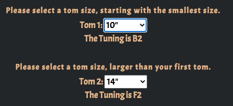

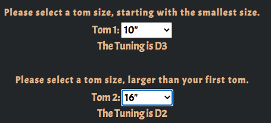

Once the form is submitted, it sends an email to the user inputted email including their form values, as well as sending an email to the site owner's email including the users inputted values. 

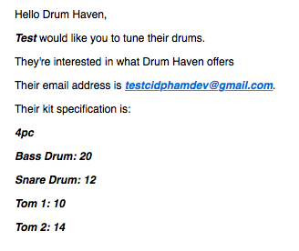

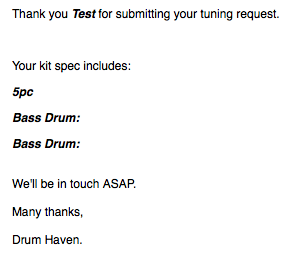


## Click addEventListener function 

During the early development of the website, a testimonials page was one idea to identify the credibility of the business, in order to make this somewhat more interactive I chose to include a Click addEventListener with a function attached. 

The function would enable the user to select the name of people who have submitted a review, it would display a paragraph element beneath it, revealing the full review as well as how many stars the review received. 

The javascript code for this action is below: 

``` let box = document.getElementsByClassName("pbox");
let i;

for (i = 0; i < box.length; i++) {
box[i].addEventListener("click", function() {
this.classList.toggle("active");
var content = this.nextElementSibling;
if (content.style.display === "block") {
content.style.display = "none";
} else {
content.style.display = "block";
}
});
}
```


However during the development, it became clear that the click event would open them and not close them until clicked again, not very conducive to a good user experience. 

Applying another methodology with jQuery and a mouseenter function for the objects was then trialled. 

The code for this is below

```
$( ".pbox" ).mouseenter(function() { $(".drop-down").show(); });

$( ".pbox" ).mouseleave(function() { $(".drop-down").hide(); });
```

This however would open all the reviews no matter which name you went on, so the solution I came upon was to individually name each review object, with their corresponding paragraph element. 

```
/* Mouse events for testimonials */

$( "#christian" ).mouseenter(function() {$( "#christian-text" ).show() });
$( "#christian" ).mouseleave(function() {$( "#christian-text" ).hide() });

$( "#jack" ).mouseenter(function() {$( "#jack-text" ).show() });
$( "#jack" ).mouseleave(function() {$( "#jack-text" ).hide() });

$( "#adrian" ).mouseenter(function() {$( "#adrian-text" ).show() });
$( "#adrian" ).mouseleave(function() {$( "#adrian-text" ).hide() });

$( "#tony" ).mouseenter(function() {$( "#tony-text" ).show() });
$( "#tony" ).mouseleave(function() {$( "#tony-text" ).hide() });
```

But with a real world application in mind, this didn't leave enough of an impact to warrant dedicating an entire page to this, along with the fact that if you were to scroll down to read more of the review, the browser window would jump back up to the top. 

This was then sidelined due to the bad user experience generated and limited functionality. 


## Form Window Alert Bug

During the latter stages of the development of the site, once the forms had been created and customised, it was of a plan to be able to make it so that when the user submitted the values into the form, they would send the information to the associated email address, as well as their own, but that they would be confronted with an instant alert window detailing the information they had just submitted. 


This was achieved, using this javaScript code. 

```
let tuningForm = document.getElementById('tuning-form');
tuningForm.addEventListener('submit', handleSubmitTune);

function handleSubmitTune(event) {

event.preventDefault();

console.log('Submitting...');

tuningForm.submit();

let tuneFullName = tuningForm.elements['#tuneFuName'].value; 
let bassDrum = tuningForm.elements['#bDrum'].value;
let tuneBrand = tuningForm.elements['#tuneBrand'].value;
let tomNotes = tuningForm.elements['#tomNotes'].value;
let snareDrum = tuningForm.elements['#sDrum'].value;
let kSize = tuningForm.elements['#kitSize'].value;
let price = document.getElementById('#tunePrice').innerHTML;

let alertHtml = `Thank you ${tuneFullName} for submitting your tuning request. 
Your kit spec includes:
Kit Size: ${kSize}
Brand: ${tuneBrand}
Bass Drum: ${bassDrum}
Snare Drum: ${snareDrum}
Your tom sizes are:
${tomNotes}

The price will be ${price}

We'll respond to you soon`;

window.alert(alertHtml);
return false
}
```

What this enabled the user to do was to get instant notification of the information they've just submitted. However, once the functionality had been achieved, with the blueprints to be able to shift this over to other pages, something went wrong. 

A bug developed, and with limited time left, unfortunately this execution had to be abandoned due to it causing errors amongst other functions. 

It seemed to be an issue once the code was copied to the other form pages, it resulted in an error in the console of the Event Listener unable to read an undefined variable, couldn't work out where the bug was, if it wasn't working with EmailJS once more forms were implemented? 


Along with that, there was the other bug of trying to display an interactive price, that would change depending on which value had been selected. 
Again, this was buggy too and seemed to correlate with the EventListener function some how, annoyingly, this too was abandoned. 

```
$(function(){
$('select[name=kitSize]').change(function(){
document.getElementById('tunePrice').textContent = tprice[$(this).val()];
});
```

Unfortunately, due to these bugs being so late into the process, it meant that without resolving them, left the website with much less user interaction, something I'm very upset with. 

However, the website works, it provides everything the user would need in being able to gather the information to make an informed decision, which if they chose to go with, meant that they could make a relevant enquiry into the services that Drum Haven provides. 